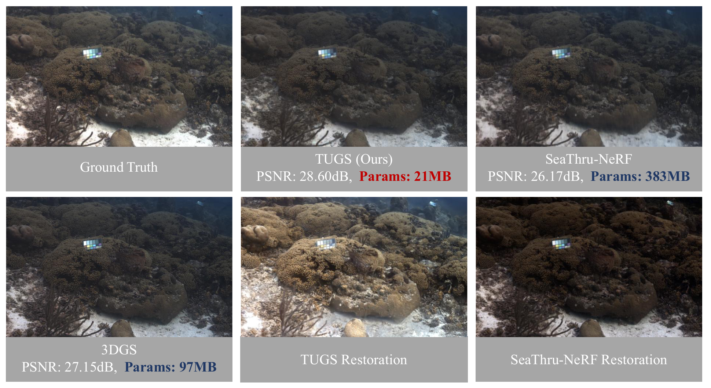
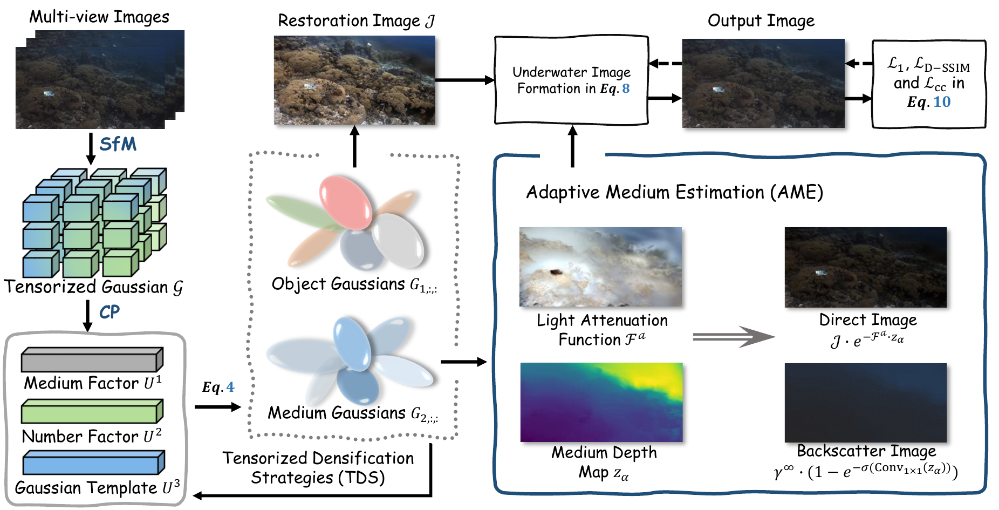
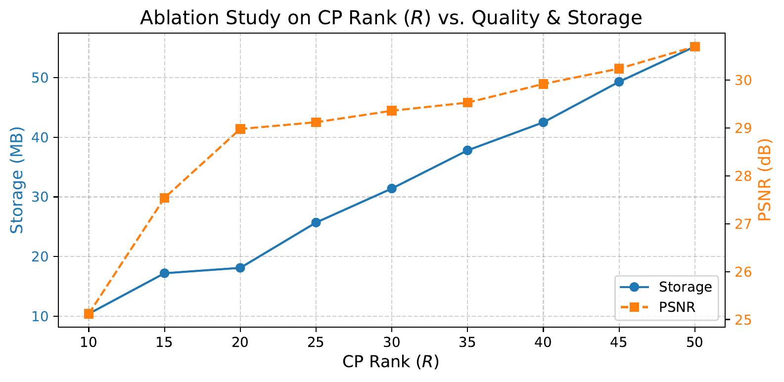

# TUGS: Physics-based Compact Representation of Underwater Scenes by Tensorized Gaussians

[](https://arxiv.org/abs/2505.08811)
[](https://github.com/LiamLian0727/TUGS/)

<p align="center">
  
</p>

This repository contains the official implementation of **TUGS**, a physics-based compact neural representation for underwater scene reconstruction. Our method has been accepted to **ICME 2026 as a Spotlight** presentation.

## 🌊 Overview

Underwater scene reconstruction faces unique challenges due to light scattering and absorption by water medium. **TUGS** addresses these challenges through:

- **Tensorized Gaussian Representation**: We employ CP decomposition (Candecomp-Parafac) to factorize 3D Gaussian parameters into compact low-rank factors, significantly reducing storage requirements while maintaining reconstruction quality.

- **Physics-based Underwater Imaging Model**: We integrate the SeaThru physical model to explicitly separate direct object signal from volumetric backscatter, enabling realistic underwater image formation.

- **Factor Sharing Strategy**: Our method shares geometric factors across the scene while allowing appearance variations, enabling compact representation (as low as **11-21 MB**) with competitive quality.

<p align="center">
  
  <br>
  <em>Overview of TUGS framework. We use CP decomposition to tensorize Gaussian parameters and employ a physics-based underwater imaging model to handle light attenuation and backscatter.</em>
</p>

## 🚀 Key Features

- **Compact Storage**: Achieves **10-35x compression** compared to standard 3DGS (383 MB → 11-21 MB)
- **High Quality**: Surpasses 3DGS by **+2.4dB PSNR** with only 50% storage at rank=50
- **Real-time Rendering**: Supports efficient rendering suitable for edge device deployment
- **Physical Correctness**: Incorporates wavelength-dependent light attenuation and backscatter modeling

## 📦 Installation

This project is built upon [NeRFStudio](https://docs.nerf.studio/). For general setup instructions, please refer to the official NeRFStudio documentation:  
🔗 [NeRFStudio Installation Guide](https://docs.nerf.studio/quickstart/installation.html)

> ⚠️ **Note**: The default recommended environment in the original repository (PyTorch 2.1.2 + CUDA 11.8) is somewhat outdated. Below we provide an updated installation workflow using **PyTorch 2.4.0 + CUDA 12.4** for improved compatibility and performance.

---

### 🛠️ Recommended Installation Steps

```bash
# 1. Create a new conda environment
conda create --name tugs -y python=3.10
conda activate tugs

# 2. Install PyTorch 2.4.0 with CUDA 12.4 support
pip install torch==2.4.0 torchvision==0.19.0 torchaudio==2.4.0 --index-url https://download.pytorch.org/whl/cu124
pip install ninja

# 3. Install core dependencies
# 💡 If installation fails during compilation, we strongly recommend using the pre-built wheels below (see "Pre-built Wheels" section)
pip install pytorch3d==0.7.9
pip install git+https://github.com/NVlabs/tiny-cuda-nn/#subdirectory=bindings/torch
pip install gsplat==1.4.0

# 4. Install COLMAP (optional but recommended for SfM preprocessing)
# Using conda-forge is the simplest method; alternatively, install from the official COLMAP website
conda install -c conda-forge colmap

# 5. Install NeRFStudio and TUGS
git clone https://github.com/nerfstudio-project/nerfstudio.git
cd nerfstudio
pip install .

git clone https://github.com/LiamLian0727/TUGS.git
cd TUGS
pip install -e .
ns-install-cli
```

### 📦 Pre-built Wheels (Highly Recommended)

To avoid common CUDA compilation errors (e.g., mismatched toolchains, missing dependencies), we **strongly recommend** installing the following pre-compiled wheels for `pytorch3d`, `tiny-cuda-nn`, and `gsplat`:

| Package | Pre-built Wheel Link |
|---------|---------------------|
| **PyTorch3D 0.7.9** | [Download .whl](https://github.com/MiroPsota/torch_packages_builder/releases/download/pytorch3d-0.7.9/pytorch3d-0.7.9%2Bpt2.4.0cu124-cp310-cp310-linux_x86_64.whl) |
| **tiny-cuda-nn 2.0** | [Download .whl](https://github.com/MiroPsota/torch_packages_builder/releases/download/tinycudann-2.0/tinycudann-2.0%2Bpt2.4.0cu124-cp310-cp310-linux_x86_64.whl) |
| **gsplat 1.4.0** | [Download .whl](https://github.com/nerfstudio-project/gsplat/releases/download/v1.4.0/gsplat-1.4.0%2Bpt24cu124-cp310-cp310-linux_x86_64.whl) |

### Installation via pre-built wheels:
```bash
# Navigate to the directory containing the downloaded .whl files
pip install pytorch3d-0.7.9+pt2.4.0cu124-cp310-cp310-linux_x86_64.whl
pip install tinycudann-2.0+pt2.4.0cu124-cp310-cp310-linux_x86_64.whl
pip install gsplat-1.4.0+pt24cu124-cp310-cp310-linux_x86_64.whl
```

> ✅ These wheels are built for:  
> - Python 3.10  
> - PyTorch 2.4.0  
> - CUDA 12.4  
> - Linux x86_64  

---

## 🏋️ Training

### Data Preparation

We use the **SeaThruNeRF dataset** for training and evaluation. The dataset should be organized with COLMAP format:
```
Dataset/
├── images_wb/          # White-balanced images
└── sparse/
    └── 0/              # COLMAP SfM output
        ├── cameras.bin
        ├── images.bin
        └── points3D.bin
```

### Training Command

We provide example training scripts in `train.sh`. Here is a basic training command:

```bash
ns-train cpgs_v4 --vis viewer+wandb colmap \
  --downscale-factor 1 \
  --colmap-path sparse/0 \
  --data /path/to/SeaThruNeRF_dataset/SceneName \
  --images-path images_wb
```

### CP Rank Selection

The **CP rank (R)** controls the trade-off between reconstruction quality and model compactness. We perform sensitivity analysis on rank selection:

<p align="center">
  
  <br>
  <em>Ablation study on CP Rank (R) vs. Quality & Storage on IUI3 Red Sea Scene. PSNR improves with R but growth stabilizes after R=20, while storage grows linearly.</em>
</p>

**Key findings**:
- **R=20** offers an optimal trade-off: **28.98 dB PSNR** with only **18.10 MB** storage
- **R=50** triples storage to 55.20 MB for 1.7 dB gain
- Even at R=50 (55 MB), we surpass 3DGS (105 MB) by **+2.4 dB** with **50% size reduction**

> 💡 **Recommendation**: We select **R=20** as the default to balance reconstruction quality and compactness, prioritizing edge deployment efficiency. You can adjust the rank in `model_zoo/tugs/tugs_cp_config.py`:
> ```python
> rank=20,  # Change this value to trade off quality vs. storage
> ```

### Training Configuration

Key hyperparameters in our method:

| Parameter | Default Value | Description |
|-----------|--------------|-------------|
| `rank` | 20 | CP decomposition rank |
| `NUM_STEP` | 20000 | Total training iterations |
| `stop_split_at` | 10000 | Stop densification at this step |
| `densify_grad_thresh` | 0.001 | Gradient threshold for densification |
| `sh_degree` | 3 | Spherical harmonics degree |

### Evaluation

```bash
ns-eval --load-config outputs/unnamed/cpgs_v4/TIMESTAMP/config.yml \
  --render-output-path renders/eval
```

## 📊 Results

Our method achieves state-of-the-art performance on the SeaThru-NeRF dataset:

### Quantitative Comparison

| Method | IUI3 Red Sea<br>PSNR↑ / SSIM↑ / LPIPS↓ | Curaçao<br>PSNR↑ / SSIM↑ / LPIPS↓ | J.G. Red Sea<br>PSNR↑ / SSIM↑ / LPIPS↓ | Panama<br>PSNR↑ / SSIM↑ / LPIPS↓ | Storage | FPS |
|--------|------------------|------------------|------------------|------------------|---------|-----|
| SeaThru-NeRF | 25.84 / 0.85 / 0.30 | 26.17 / 0.81 / 0.28 | 21.09 / 0.76 / 0.29 | 27.04 / 0.85 / 0.22 | 383 MB | 0.09 |
| TensoRF | 17.33 / 0.55 / 0.63 | 23.38 / 0.79 / 0.45 | 15.19 / 0.51 / 0.59 | 20.76 / 0.75 / 0.38 | 66 MB | 0.21 |
| 3DGS | 28.28 / 0.86 / 0.26 | 27.15 / 0.85 / 0.25 | 20.26 / 0.82 / 0.23 | 30.23 / 0.89 / 0.19 | 75-105 MB | 154.9 |
| SeaSplat | 26.47 / 0.85 / 0.28 | 27.79 / 0.86 / 0.27 | 19.21 / 0.70 / 0.35 | 29.79 / 0.88 / 0.19 | 104-140 MB | 80.7 |
| UW-GS | 27.06 / 0.84 / 0.27 | 27.62 / 0.87 / 0.25 | 20.05 / 0.71 / 0.32 | 31.36 / 0.90 / 0.17 | 61-78 MB | 78.6 |
| **Ours (R=20)** | **28.98 / 0.86 / 0.26** | **28.60 / 0.88 / 0.23** | **22.21 / 0.84 / 0.23** | **31.19 / 0.92 / 0.16** | **11-21 MB** | **106.7** |
| **Ours (R=30)** | **29.36 / 0.87 / 0.25** | **28.71 / 0.87 / 0.22** | **22.43 / 0.86 / 0.22** | **31.51 / 0.92 / 0.15** | **31-43 MB** | **82.1** |

### Key Achievements

- **🥇 Best Compression-Quality Trade-off**: Ours (R=20) achieves comparable or better quality than 3DGS with **5-10x less storage**
- **⚡ Real-time Rendering**: 106.7 FPS at R=20, faster than SeaSplat and UW-GS
- **📈 State-of-the-Art Quality**: Ours (R=30) achieves the best PSNR across all scenes with competitive storage

## 🙏 Acknowledgements

We sincerely thank the following projects for providing and maintaining pre-built wheels, which significantly simplify the installation process:

- 🔗 [MiroPsota's Torch Packages Builder](https://miropsota.github.io/torch_packages_builder)  
- 🔗 [gsplat official wheel repository](https://docs.gsplat.studio/whl/gsplat/)

This project is built upon [NeRFStudio](https://docs.nerf.studio/) and [gsplat](https://github.com/nerfstudio-project/gsplat). We thank the original authors for their excellent work.

## 📄 Citation

If you find this work useful for your research, please cite:

```bibtex
@inproceedings{lian2026tugs,
  title={TUGS: Physics-based Compact Representation of Underwater Scenes by Tensorized Gaussians},
  author={Lian, Shijie and Zhang, Ziyi and Yang, Laurence Tianruo and Ren, Mengyu and Liu, Debin and Li, Hua},
  booktitle={Proceedings of the IEEE International Conference on Multimedia and Expo (ICME)},
  year={2026},
  organization={IEEE}
}
```
